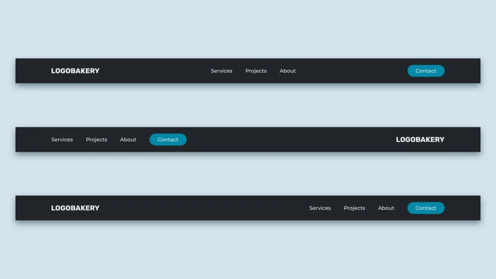

# CSS-navbar-flex
A repo the practice CSS flexbox by creating 3 different kinds of navbars

This exercise is downloaded from: https://skillthrive.gumroad.com/l/QsaXx.  
I am using it in order to improve my CSS and Flexbox skills.

Here is a picture of the final outcome in 3 different styles:\n 

There is a video tutorial for this on Youtube: https://youtu.be/PwWHL3RyQgk?si=KjUrP__FZ_wgziY5